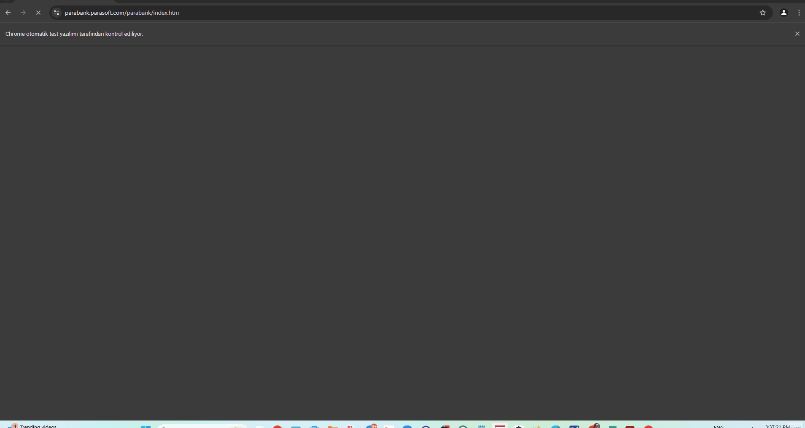
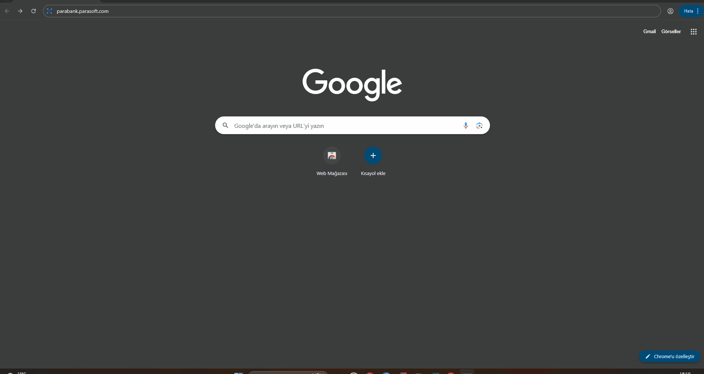
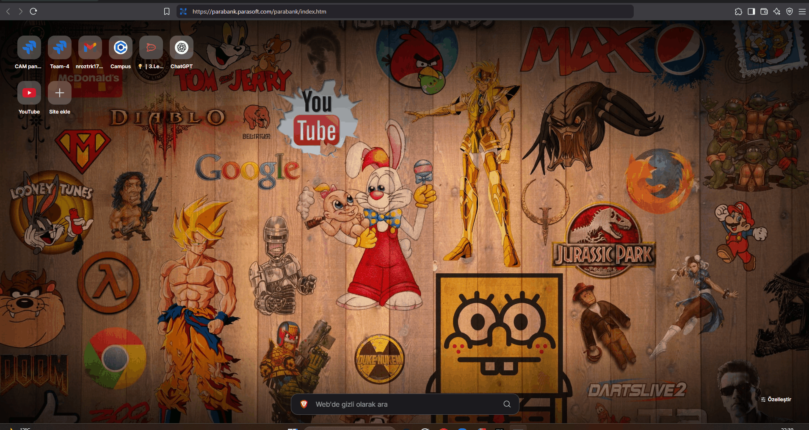
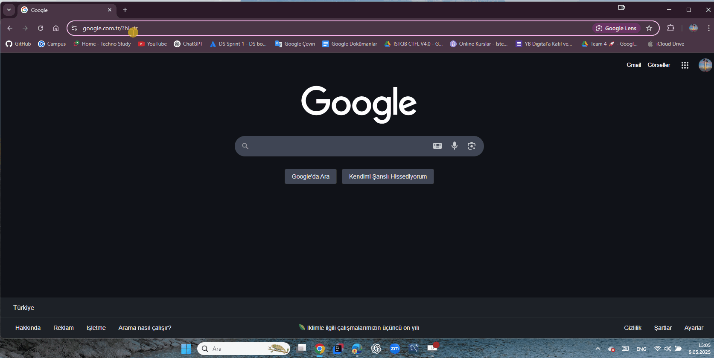
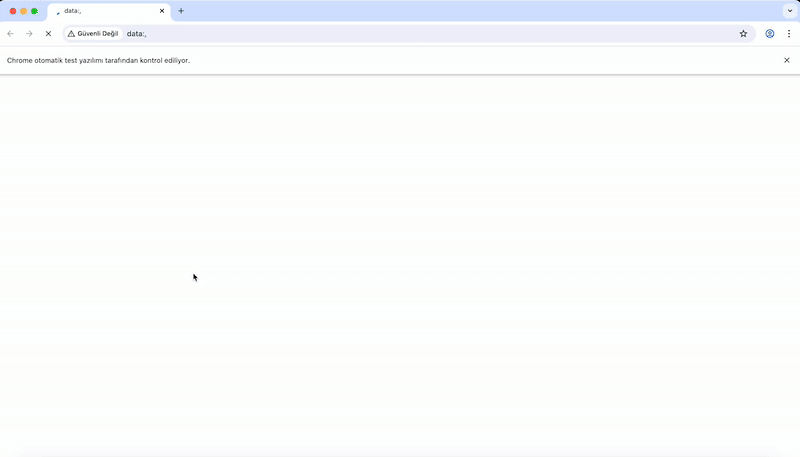
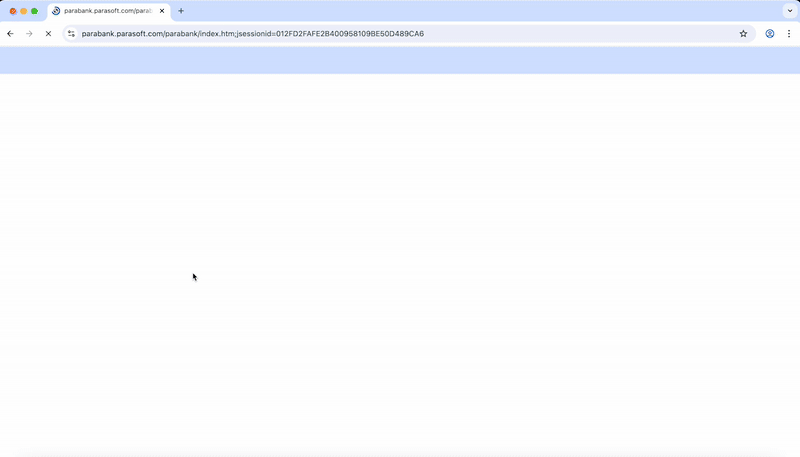

# 🧪 ParaBank Cucumber Automation Project

## 📌 Table of Contents

- [Project Description](#project-description)
- [Project Structure](#project-structure)
- [Technologies Used and Dependencies](#-technologies-used-and-dependencies)
- [Installation](#installation)
- [Usage](#usage)
- [User Stories & Test Scenarios](#user-stories--test-scenarios)
- [Test Coverage Table](#test-coverage-table)
- [Test Reports](#test-reports)
- [Bug Reports](#bug-reports)
- [Project Team](#project-team)
- [GitHub Links](#github-links)
- [License](#license)
- [Contact](#contact)

---

## 📄 Project Description

ParaBank is a virtual banking application that represents a simulated environment for testing and simulating financial
transactions.
It is not a real financial institution but is used in place of a real banking application during software testing.
The test environments provided above are designed for performing various operations that users can execute in a
web-based banking application.
They are valuable tools for simulating financial transactions such as account creation, money transfers, credit
application submissions, and bill payments. They are utilized for implementing various test scenarios.
This project automates functional UI tests for the [ParaBank Project](https://parabank.parasoft.com/parabank/index.htm)
using **Java**,**Selenium WebDriver**, **Cucumber**, **TestNG**, and the **Page Object Model (POM)**, **Scenario Outline
**, **Data Table**.
The project adopts BDD principles and parallel test execution for scalable automation.

### 🔍 Test Environment

> 🔗 [https://parabank.parasoft.com/](https://parabank.parasoft.com/)  
> 🧪 Alternative: [https://para.testar.org/](https://para.testar.org/)

---

### 💪 Key Features:

- **Cucumber with Gherkin syntax** for human-readable test cases
- **TestNG + XML execution** with browser parameterization
- **Thread-safe WebDriver management** with `ThreadLocal`
- **ExtentReports Integration** for both HTML and PDF reporting
- **Page Object Model (POM)** for maintainable test code
- **Healenium** for dynamic locator handling
- **Scenario Outline** for data-driven testing
- **Data Table** for parameterized tests

---

## 🏠 Project Structure

```plaintext
ParaBankProject_Cucumber/
├── src/
│   └── test/
│       │
│       ├── java/
│       │   ├── featureFiles/                # .feature files written in Gherkin
│       │   ├── hooks/                       # Cucumber Hooks (Before/After)
│       │   ├── pages/                       # Page Object Model classes
│       │   ├── runners/                     # TestNG runner classes
│       │   │   └── XML/                     # TestNG XML configuration files
│       │   ├── stepDefinitions/             # Cucumber step definitions
│       │   └── utilities/                   # Driver, ConfigReader, ExtentReportManager, etc.
│       │
│       └── resources/                       # ExtentReports configuration
│
├── testBugReports/                          # Bug reports (if any)
├── testGifs/                                # GIFs used in reports
├── testReports/                             # Spark & PDF report output (auto-generated)
├── configuration.properties                 # General test configuration
├── pom.xml                                  # Maven build configuration
└── README.md
```

---

## 🧰 Technologies Used and Dependencies

All required dependencies are declared in `pom.xml`.
Ensure Maven updates all packages automatically.

| Tool / Library                 | Description                                         |
|--------------------------------|-----------------------------------------------------|
| Java JDK 21                    | Programming Language                                |
| Selenium WebDriver 4.31.0      | Web Automation Library                              |
| Cucumber 7.20.0                | BDD Testing Framework                               |
| TestNG 7.10.2                  | Test Execution Engine                               |
| ExtentReports + Adapter 1.14.0 | Spark + PDF reporting integration                   |
| Maven                          | Project Build + Dependency Manager                  |
| SLF4J + Log4j                  | Logging                                             |
| Healenium-web                  | Locator catching                                    |
| Java **Faker** library         | Dynamically generate unique and realistic test data |

---

## 🚀 Installation

1. Clone the repository:
   ```bash
   git clone https://github.com/AzimKorkmaz/ParaBankProject_Cucumber.git
   ```
2. Open the project in **IntelliJ IDEA** or your preferred IDE.
3. Run:
   ```bash
   mvn clean install
   ```
---

## 🛠️ Usage

- To execute **all tests** with default configuration:
  ```bash
  mvn test
  ```
- To run **specific browser tests**:
    - Open `singleBrowserTesting.xml` or `parallelBrowserTesting.xml` in the `runners/XML/` folder.
    - Right-click and run the XML file.
    - Or You can run the feature file directly by right-clicking on the feature file in the `featureFiles/` folder.

---

### 🧾 Key Features Tested

- ✅ **User Registration:** Creation of user accounts and success message validation.
- ✅ **User Login:** Validation of login success/failure with correct and incorrect credentials.
- ✅ **Bill Payment:** Payments for electricity, water, and natural gas bills.
- ✅ **Account Creation:** Creating checking and savings accounts.
- ✅ **Money Transfer:** Transfer of funds between internal accounts.
- ✅ **Contact Info Update:** Editing and verifying profile data.
- ✅ **Loan Application:** Applying for loans and handling of both approval and denial scenarios.

---

## 🧰 User Stories & Test Scenarios

### **1️⃣ US_601 - User Registration**

📌 The user, wants to create a new user account by registering on the Para Bank website.

✅ Expected: After clicking on the "Register" link, the user must fill in the required fields, successfully register and
log in to the system.

✅ Actual: The user filled in the form, registered, received a success message and logged into the system.



### **2️⃣ US_602 - User Login**
#### ➕ **Positive Scenario**

📌 The user wants to log in to the system with a valid username and password.

✅ Expected: The user must be able to log in successfully and then log out.

✅ Actual: The user logged in and successfully logged out of the system.



#### ➖ **Negative Scenario**

📌 The user is trying to log in to the system with invalid information.

✅ Expected: The input must fail and an appropriate error message must be displayed to the user.

✅ Actual:  The login failed and the user was shown an error message.



### **3️⃣ US_603 - Bill Payment**

📌 The user wants to make payments by entering invoice types such as electricity, water or natural gas into the system.

✅ Expected: The payment must be successfully completed, updated in the system and appear in the payment list.

✅ Actual: The user made the invoice payment, the system showed a successful message and it was included in the payment
list.


### **4️⃣ US_604 - New Account Creation**
#### ➕ **Positive Scenario – Checking Account Creation**

📌 The user wants to create a new demand deposit account on the para bank website.

✅ Expected: The user must create the new account, receive a confirmation message and see the account number.

✅ Actual:  The user created a new demand deposit account, received a confirmation message and the account number was
displayed.


#### ➕ **Positive Scenario – Saving Account Creation**

📌 The user wants to open a new term account by entering the parabank system.

✅ Expected: The new account should be created successfully and the confirmation message and account number should be
displayed.

✅ Actual:  The user created the new term account, the system showed a successful message and provided the account
number.


### **5️⃣ US_605 - Money Transfer**
#### ➕ **Positive Scenario – Money Transfer**

📌 The user wants to transfer a certain amount between the two accounts they have.

✅ Expected: The transfer must be successful, a confirmation message must be displayed to the user and the transaction
must be included in the account statement.

❌ Actual: After the money transfer, when you go to the Find Transactions link and query the Transaction ID, 
the website does not show the transfer made. Transfers made with other query fields such as transfer date, transfer amount are displayed.



#### ➖ **Negative Scenario – Money Transfer**

📌 The user wants to verify this transaction using the transaction ID of a past money transfer.

✅ Expected: The transaction with the Transaction ID must be found and the transaction amount must be the same as before.

✅ Actual: The transaction with Transaction ID was found and the amount matched.

### **6️⃣ US_606 - Contact Info Update**
#### ➕ **Positive Scenario – Contact Info Update**

📌 The user wishes to update contact information such as address, city, postcode and telephone number.

✅ Expected: The updated information must be successfully saved, a confirmation message must be displayed and
this information must be correctly displayed when the user logs in again.

❌ Actual: When the user wanted to change any of his/her information, for example,
even if he/she entered numbers or special characters in the surname, the system accepted this information. therefore a bug ticket was created.


#### ➖ **Negative Scenario – Contact Info Update**

📌 The user is trying to update contact details with incomplete information.

✅ Expected: The system should not allow updates and should display warning messages about missing fields.

✅ Actual: No update was made, warning messages were shown to the user.


### **7️⃣ US_607 - Loan Application**
#### ➕ **Positive Scenario - Loan Application**

📌 The user wants to apply for a loan with valid data and expects approval.

✅ Expected: The user must be able to apply for a loan, see the result instantly, receive an 'Approved' message, and see
the new account number. The user should verify that there are no transactions in the new account.

✅ Actual: The user applied for a loan, received an approval message, saw the new account number, and verified that there
were no transactions in the new account.



#### ➖ **Negative Scenario - Loan Application**

📌 The user tries to apply for a loan with invalid data and expects rejection.

✅ Expected: The user must see the result instantly, receive a 'Denied' message, and see the reason for the rejection.

✅ Actual: The user applied for a loan with invalid data, received a denial message, and saw the reason for the
rejection.



---

## 🧰 User Stories & Test Scenarios

| User Story | Description          | Status   |
|------------|----------------------|----------|
| US_601     | User Registration    | ✅ Passed |
| US_602     | User Login           | ✅ Passed |
| US_603     | Bill Payment         | ✅ Passed |
| US_604     | New Account Creation | ✅ Passed |
| US_605     | Money Transfers      | ❌ Failed |
| US_606     | Contact Info Update  | ❌ Failed |
| US_607     | Loan Application     | ✅ Passed |

---

## 📊 Test Coverage Table

| Scenario             | Priority |
|----------------------|----------|
| User Registration    | Highest  |
| User Login           | Highest  |
| Bill Payment         | Highest  |
| New Account Creation | High     |
| Money Transfers      | Medium   |
| Contact Info Update  | Medium   |
| Loan Application     | High     |

---

## 📊 Test Reports

| Report Type      | Description                             |
|------------------|-----------------------------------------|
| **Spark Report** | Rich HTML report with steps/screenshots |
| **PDF Report**   | Clean summary with scenario results     |

Find reports inside:

```markdown
- /testReports/SparkReport/
- /testReports/PDFReport/

```

---

## 📅 Bug Reports

**Bug reports are tracked in the GitHub Issues section of the repository.**

**US_606 Contact Info Update**
❌ when the user wanted to change any of his/her information, for example, 
even if he/she entered numbers or special characters in the surname, the system accepted this information. therefore a bug ticket was created.

**US_605 Money Transfers**
❌ After the money transfer, when you go to the Find Transactions link and query the Transaction ID,
the website does not show the transfer made. Transfers made with other query fields such as transfer date, transfer amount are displayed.

---

```markdown
- testBugReports/US_606 Contact Detail BugReports.pdf
- testBugReports/US_605 Transfer Money Between My Accounts BugReports.pdf
```
---

## 👥 Project Team

| Name          | Role                       | User Stories |
|---------------|----------------------------|--------------|
| Azim Korkmaz  | Project Lead & QA Engineer | US_604       |
| Zafer Ataklı  | QA Engineer                | US_601       |
| Nuri Öztürk   | QA Engineer                | US_602       |
| Rıfat Batır   | QA Engineer                | US_603       |
| Tugba Kilic   | QA Engineer                | US_605       |
| Yigit Cam     | QA Engineer                | US_606       |
| Sibel Oztemel | QA Engineer                | US_607       |

---

## 🔗 GitHub Links

- 📁 [Main Repository](https://github.com/AzimKorkmaz/ParaBankProject_Cucumber)

**Contributors:**

- [Zafer Ataklı](https://github.com/zaferatakli)
- [Rıfat Batır](https://github.com/rftbtr)
- [Tugba Kilic](https://github.com/TugbaKilic33)
- [Nuri Öztürk](https://github.com/NuriOzturk)
- [Azim Korkmaz](https://github.com/AzimKorkmaz)
- [Yigit Cam](https://github.com/Yigit-Cam)
- [Sibel Oztemel](https://github.com/Sibel52)

---

## 📜 License

This project is licensed under the [MIT License](https://opensource.org/licenses/MIT).

---

## 📧 Contact

For any questions or suggestions, please reach out via GitHub or team leads listed above.

---